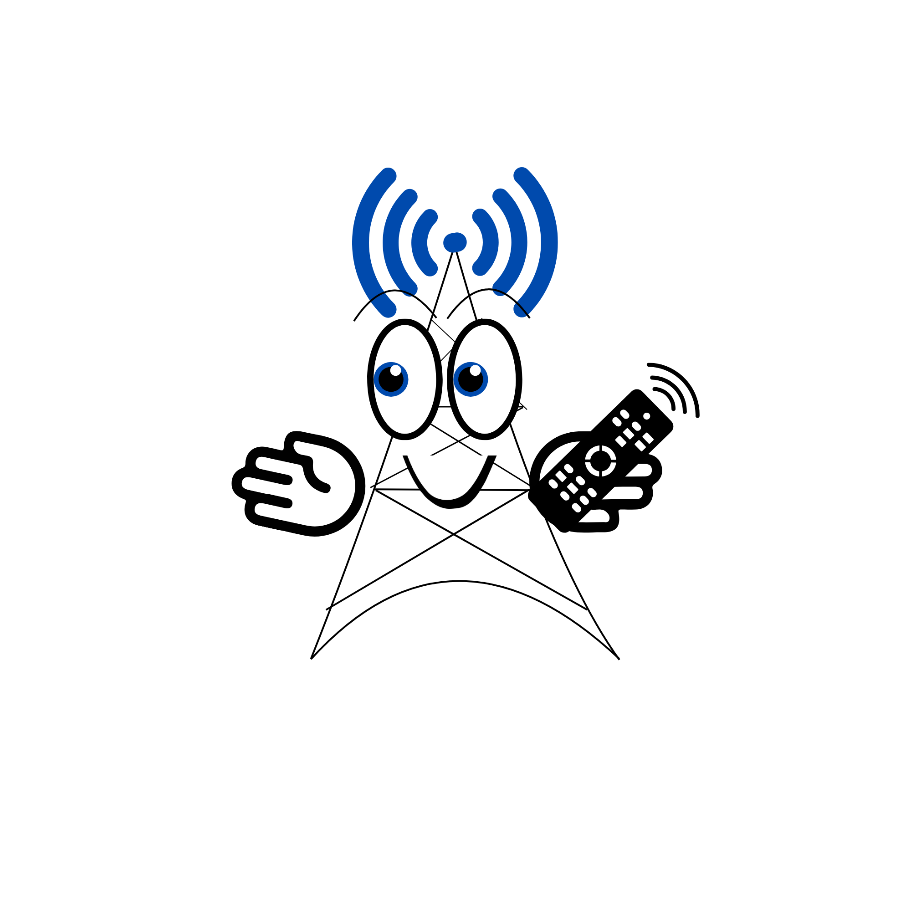

#  NeawStreamV-player

  
  
  

¡Bienvenido a **NeawStreamV-player**! Una solución multimedia desarrollada en **Flutter**, diseñada para ofrecer una experiencia de reproducción fluida y eficiente tanto en **dispositivos móviles** como en **Android TV  y Windows**.

## Disclaimer
**"NeawStreamV-player" es un reproductor multimedia de propósito general. El software no contiene, proporciona, ni preinstala ningún tipo de lista de canales, contenido multimedia, o enlaces a fuentes externas. El usuario es el único responsable de la legalidad, propiedad y uso de los contenidos que decida cargar o reproducir mediante la aplicación. El autor no apoya ni fomenta el uso de material protegido por derechos de autor sin la debida licencia.**¡Gracias por usar NeawStreamV-player!

##  Características

* **Compatibilidad M3U:** Carga tus listas de reproducción favoritas de manera rápida.
* **Contenido Xtream:** Soporte nativo para servicios basados en códigos Xtream.
* **Optimizado:** Interfaz intuitiva, diseñada para funcionar perfectamente con mandos de TV y pantallas táctiles.
* **Fluidez:** Bajo consumo de recursos y alta velocidad de carga.

##  Capturas de pantalla

| PC | TV | Phone |
| :---: | :---: | :---: |
|  |  |  |

###   Instalación Windows

Para comenzar a disfrutar de la aplicación, solo sigue estos sencillos pasos:

1.**Descarga:** Ve a la sección de **[Releases](https://github.com/WykosVx/NeawStreamV-player/releases)** y descarga el archivo NeawStreamV-player.v-5.0.0.rar.

2.**Descompresión:** Haz clic derecho sobre el archivo descargado.

3.**Selecciona "Extraer todo..."** y elige la carpeta donde prefieras tener la aplicación.

4.**Ejecución:** Abre la carpeta descomprimida.

5.Haz doble clic en neawstreamvplayer.exe para iniciar.

###  Instalación Android

1. **Descarga** el archivo APK más reciente desde la sección de **[Releases](https://github.com/WykosVx/NeawStreamV-player/releases)**.
2. **Instálalo** en tu dispositivo Android o Android TV.
3. ¡Carga tu lista y comienza a disfrutar!

##  License
This project is under the **MIT License**. Check the [LICENSE](LICENSE) file for more details.
