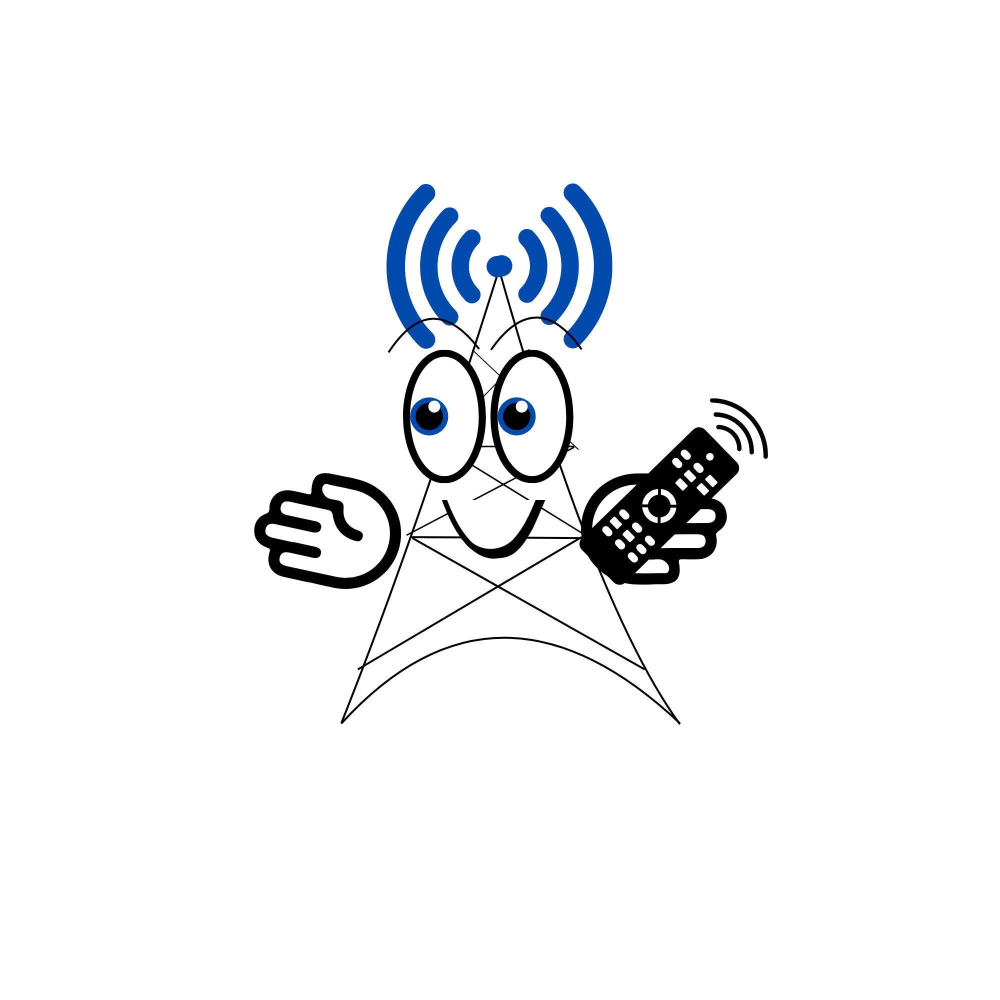

 NeawStreamV-player

  <!-- ==================== SECCIÓN DE IMÁGENES ==================== -->
  <table border="0">
    <tr>
      <td align="center" valign="middle">
        
      </td>
  </table>

   

  <!-- ==================== INFORMACIÓN Y ESTADO ==================== -->
  
  
  

    

  <!-- ==================== TECNOLOGÍAS USADAS ==================== -->
  
  
  

  

Welcome to **NeawStreamV-player**! A multimedia solution developed in Flutter, designed to offer a smooth and efficient playback experience on mobile devices, Android TV

Bienvenido a NeawStreamV-player Una solución multimedia desarrollada en **Flutter**, diseñada para ofrecer una experiencia de reproducción fluida y eficiente tanto en **dispositivos móviles

## Disclaimer
**"NeawStreamV-player" es un reproductor multimedia de propósito general. El software no contiene, proporciona, ni preinstala ningún tipo de lista de canales, contenido multimedia, o enlaces a fuentes externas. El usuario es el único responsable de la legalidad, propiedad y uso de los contenidos que decida cargar o reproducir mediante la aplicación. El autor no apoya ni fomenta el uso de material protegido por derechos de autor sin la debida licencia.**
¡Gracias por usar NeawStreamV-player!

**"NeawStreamV-player" is a general-purpose multimedia player. The software does not contain, provide, or pre-install any channel lists, multimedia content, or links to external sources. The user is solely responsible for the legality, ownership, and use of the content they choose to load or play via the application. The author does not endorse or encourage the use of copyrighted material without the proper license.** 
¡Thank you for using NeawStreamV-player!

##  Características

* **Optimizado:** Interfaz intuitiva, diseñada para funcionar perfectamente con mandos de TV y pantallas táctiles.
* **Fluidez:** Bajo consumo de recursos y alta velocidad de carga.

##  Capturas de pantalla/Screenshots

 TV | Phone |
| :---: | :---: |
  |  |

###  Instalación Android

1. **Descarga** el archivo APK más reciente desde la sección de **[Releases](https://github.com/WykosVx/NeawStreamV-player/releases)**.
2. **Instálalo** en tu dispositivo Android o Android TV.
3. ¡Carga tu lista y comienza a disfrutar!

##  License
This project is under the **MIT License**. Check the [LICENSE](LICENSE) file for more details.

#   Apoyando el desarrollo

¡Gracias por interesarte en apoyar **NeawStreamV-player**! Este proyecto se mantiene gracias al esfuerzo y tiempo dedicado a su desarrollo.

Si deseas colaborar con el mantenimiento y las mejoras continuas, puedes hacerlo de forma voluntaria a través de Bitcoin (BTC).

###  Criptomonedas (Exodus)
Si prefieres apoyar mediante cripto, puedes enviar tu donación a mi dirección de Bitcoin:

| Código QR | Dirección BTC |
| :--- | :--- |
|  | `bc1q7eqkvm5asunhr3k494xg6f9tv2073ffhwac0y4` |

**Nota:** Asegúrate de enviar únicamente Bitcoin a esta dirección Gracias.

¡Cualquier apoyo es sumamente valorado y ayuda a seguir mejorando este proyecto!
